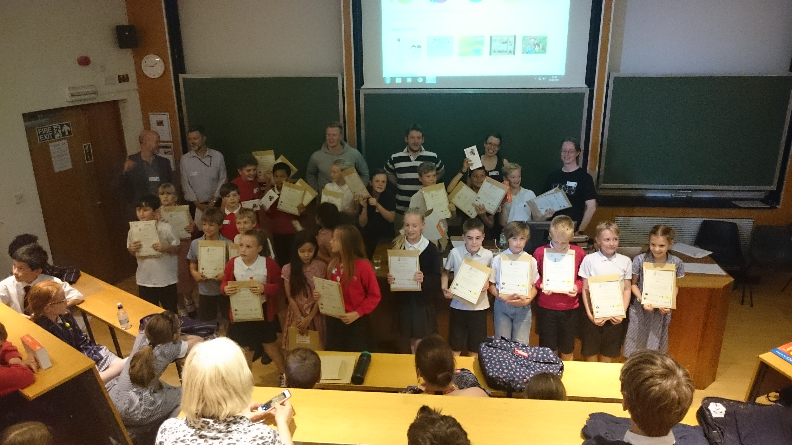

For the last couple of years, Neontribe have been sponsors of the annual CAS SCRATCH OFF competition.

The event is run by <a href="http://norfolkcashub.org/">Computing at Schools' Norfolk hub</a>, in partnership with <a href="https://www.uea.ac.uk/computing">UEA's Computer Science department</a>. Participants pair up to take on challenges in either the primary (KS2) or the lower secondary (KS3) age group competitions, and a range of primary and high schools across Norfolk signed up for the challenge. Overall, over 100 kids were involved in the day, with a fair number of their teachers and independent judges on hand to guide and assist.

This year, I had the privilege to represent Neontribe and judge the primary age group competitions, as well as hand out 2 prizes – this year, some Raspberry Pi starter kits. There were 2 challenges for the lower age group: a prepared game, and an unseen challenge. The unseen challenge had to be completed during the morning of the competition, during which the prepared game would also be inspected by the judging team. Then, in the afternoon session, the finalists for each task demonstrated their attempts to the judges and everyone else, with prize-winners subsequently announced.

As for the challenges themselves, the prepared game had to involve 3 unique levels or mini-games, all wrapped up in the same program. This gave the kids a great opportunity to create stories and narratives to give their games more meaning. Amongst my favourite of the attempts featured a scared knight trying to avoid hosts of different horrible creatures!

The unprepared challenge was for the pairs to create a drawing tool application, featuring a frog, and to be controlled via using the keyboard arrow keys. Some of the pairs progressed so well that the frogs could even have different line colours and thicknesses, and different backdrops on which to draw - although I don't think it's realistic to expect frogs to live too long in a deep sea underwater environment!

All of the programming was done by using <a href="https://scratch.mit.edu/about">Scratch</a>, which helps young people get into programming in a fun and engaging way; many schools have adopted it for their classes, as there is little setup overhead. There are always great beginning Scratch resources available freely online which do a great job of introducing a kid into programming!

I always find it refreshing to see how kids tackle challenges! Even with some limited experience, each of the pre-prepared games I saw were humorous and engaging. Another great thing about the primary school entrants was the number of girls taking part, and indeed the high proportion of mixed gender pairs who were able to bounce different ideas off one idea in a highly constructive way.

Here's to the future and to the next wave of programmers!
