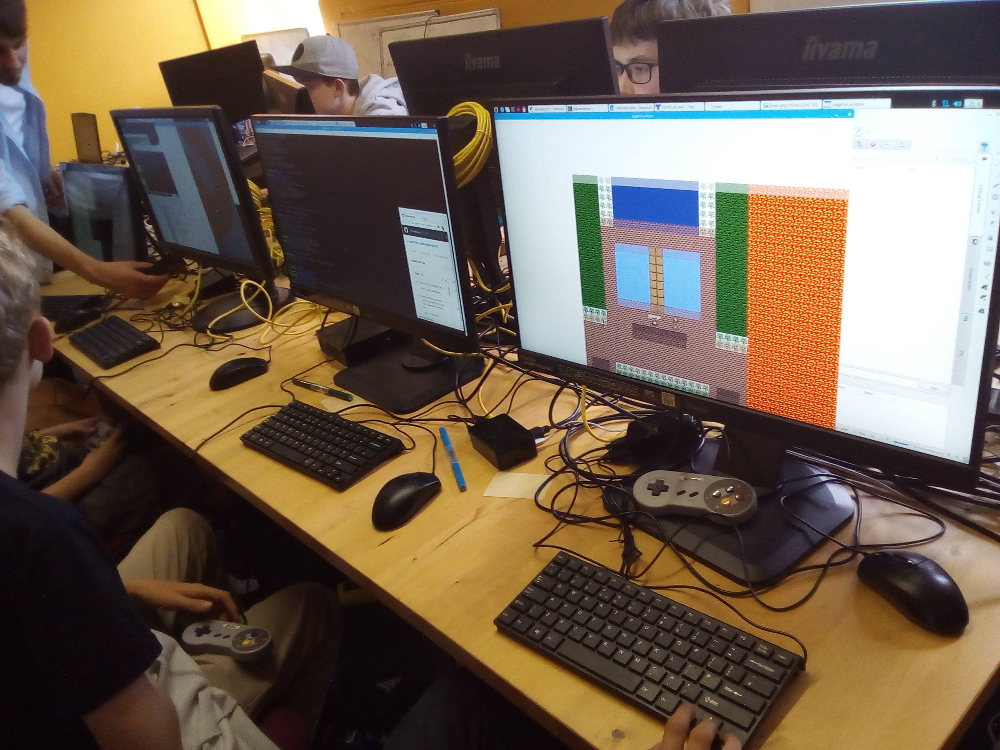
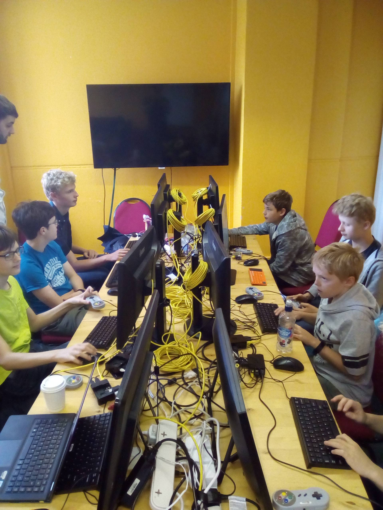

Neontribe has run a summer code camp every year for near a decade. Last year, we made it our own thing under the banner Untangled 2016. Local tech events for young people can be difficult to find, so doing it again was an easy call.

During Untangled 2017, 8 young people from the Norwich area took part in a week long event to create a game. Untangled is all about young people making the decisions, they collectively agreed on the style. Ideas such as a ‘Hunger Games’ scenario and a 'Battle Royale' type game were discussed with a final vote to decide. The result? A top down capture the flag game.

The young people were mentored by Neontribe staff and local game developers, teaching and assisting with the creation of the game.

Using [Raspberry Pi’s](https://thepihut.com/products/raspberry-pi-3-retro-gaming-bundle) and the [Python](https://www.learnpython.org/) programming language they started their journey into software development…

Day 1 of the event consisted of orientation and planning:

- Teaching everyone the basis of maintaining version control using Git in their own [GitHub](https://www.github.co.uk) account.
- Making sure everyone knew the core concepts of working on a team project and how to make concurrent changes to the code.
- All of the development work was then planned out and each task was assigned to someone based on their interests, whether they were a programmer or a more visual designer.

The following days were spent developing the functionality:

- George [(@GLBro)](https://github.com/GLBro) and Nat [(@whizzer0)](https://github.com/whizzer0) making the map of the game.
- Raphie [(@Raph-child)](https://github.com/Raph-child) and Oli [(@DuctTapeNinja)](https://github.com/DuctTapeNinja) worked together to add spells and projectiles.
- James [(@LiveG-Technologies)](https://github.com/LiveG-Technologies) maintained the documentation by creating a [wiki.](https://github.com/neontribe/untangled-2017/wiki)
- Ruben [(@thegraphicsgamer)](https://github.com/thegraphicsgamer) was the textures man, editing each individual texture to fit the game.
- James [(@OverHill123)](https://github.com/OverHill123) worked on power-ups for the game, letting the player perform actions such as increasing their speed to gain an advantage.
- and some even tried to hack the game(!) - an unspecified design goal.

Development was successful enough that advanced functionality was eventually added to the engine; a minimap, displaying player locations, and a HUD which displayed information about the player, both by Harry [(@spannner)](https://github.com/spannner).

Neontribe kept to the industry standard for fixing bugs, 1 bug fix equals 1 Kit-Kat! Favourite bugs reports?

[Make everything not lava](https://github.com/neontribe/untangled-2017/issues/75)

and the beautiful;

[Bullets need to go faster because all clients can out run it](https://github.com/neontribe/untangled-2017/issues/84)

The final day of Untangled 2017 was spent playing the finished game, the highlight being the developers vs Neontribe in a 4v4 capture the flag match, fueled with childish screaming and frustration coming almost exclusively from the Neontribers. The event was concluded with a presentation given by the young people, explaining their experiences and what they had learnt over the week.

Neontribe believes learning never stops, so everyone was given their Raspberry Pi’s to leave with, letting them continue to code at home and of course play their amazing game!

The code for the game can be found at [Untangled-2017.](https://github.com/neontribe/untangled-2017)

**Many thanks to Paul and Luke from [SoftApps](http://softapps.co.uk) for mentoring and helping with the event!**
